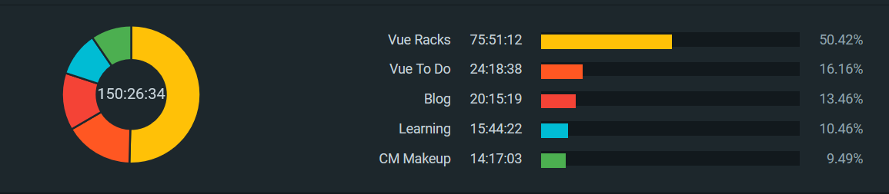
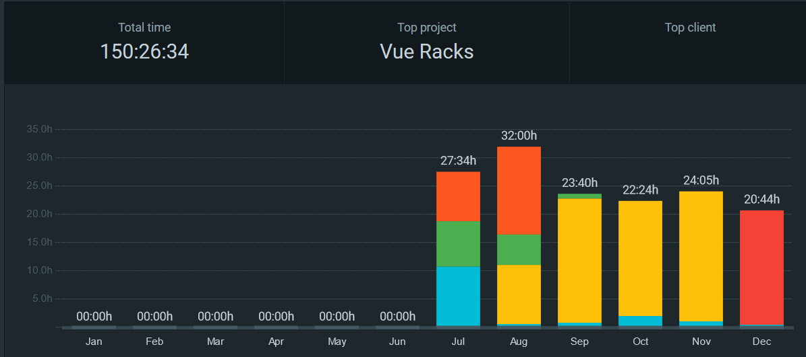

# The Reason

Scripting has always been one of the most enjoyable parts of my job. I love automating annoying, repetitive jobs, so I don't have to do them anymore. So I'd always been interested in the dev side of things and wondered if I could make a go of it.

I didn't plan on joining the **#100Days** movement (and don't have one of those "Tweeter" account things, to tell other people about it), I really just wanted to set this goal of improving my software development skills. However, I'm terminally lazy slash quite busy outside of work, so I set of goal of trying to practice coding _every day_.

This wasn't because I'm super good at goal setting, precisely the opposite. It's because I knew if I set a goal "Try code 4 hours a week" or something similar, I'd always be "too busy" to do any work on it each day. 
The only way, I thought, was to allow myself no excuses, no wiggle room, just every day, pick up the damn keyboard and start typing. 
And hey, it worked!

I managed to "work on my coding" every day, for at least 30 minutes, for 180 days straight!

By "work on coding", I defined as either a) coding b) reading coding documentation or occassionally c) watching a tutorial video etc.

# Tool Recommendations!

For the persistent procrastinator, there's nothing like "optimizing your workflow" with some great tools, to make you _feel_ like you're making progress... without actually doing anything ;)

Here are some of the cool tools that I used!

## Visual Studio Code
Because it's awesome!

## [Clockify](https://clockify.me/)
There are loads of time tracking apps out there, but I liked this one because it has...

  * Simple interface for starting/stopping time tracking
  * Various ways to categorize time entries (narrative, project, client, tags)
  * Heaps of integration options! Their browser extension integrates with loads of different web apps like Trello, Salesforce, Basecamp, Zendesk etc. so you can click a little button and start time tracking right from the other app!
  * An API. Super handy, so I can extract the data or start/stop timers just from a terminal.

## [iDot Habit](https://play.google.com/store/apps/details?id=com.ibuild.idothabit)

I got onto this app after reading about the bullet journal method of tracking habits, and I liked the mind-hacking nature of compelling yourself to do something simply because you didn't want to "break the streak".

I tried a couple of other apps, but found this was a great combo of a simple UI, but with enough customization possible hidden behind a few menus etc.

# So, What Did I Do?
I really didn't want to spend 100+ days on "coding" and come out having just watched a bunch of tutorials. So, watched a few Getting Started type vids, then tried to dive right into a project.

I really recommend this way of learning, _but_ with a healthy dose of RTFM in there. There's bits of the VueJS Docs (like [Reactivity In Depth](https://vuejs.org/v2/guide/reactivity.html)) that I've read 3-4 times over, and each time I'll pick up another "gotcha". 

Learning by doing is great, but its much easier for something to stick if you understand _the why_.

I attempted 4 different projects during this time (in this order):

* A website for a makeup artist, using Boostrap, HTML & CSS, and hosting from Azure Storage
* Vue ToDo - a ToDo app, just to get me familiar with VueJS
* Vue Racks - a datacentre rack management web app, using VueJS
* This blog - built using Nuxt, VueJS and Azure Static Web Apps

The Vue Racks project was definitely the largest - almost 80h in total However, I'm still amazed at how much I created in 80h, versus the utter lack of amazing-ness of Vue ToDo, which took me 25h!

It just shows you the learning curve that you go through, when first coming to grips with a new thing. The makeup website took hours for quite a little amount of progress, but refreshed me on some basics of HTML, CSS & JavaScript.

Then, the Vue ToDo app introduced me to "modern JavaScript apps", with all the cool kid problems like routing and state management.

I went back to Vue ToDo quite a few times when first building Vue Racks, trying to remember how I'd done something, but managed to build the initial prototype within a few hours.

Then, this blog is a bit of a blend of all the previous projects - Static Web App hosting, but using Nuxt/Vue for the static site generation, and learning how to get some of those basic HTML things like script tags into Nuxt, and then some CI/CD by way of Github Actions, to actually get the site to build & deploy! 

Whew!

# All Done?

All up, I did just over 150h, and coincidentally, ended on New Years Eve - 180 days later.

It was a great challenge, and I don't think I would have done it if I didn't genuinely enjoy the coding.

My plan is to keep going in 2021, but now I know I can stick to a goal, I'll be allowing myself a few more breaks.

Hopefully I can post a follow up to this in 2022 detailing how much more I've learned in the next 12 months!

/sysadmin