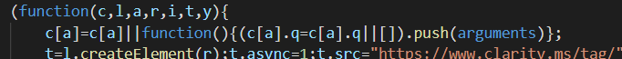
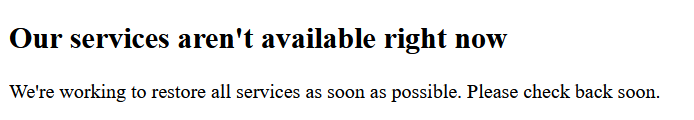

# Dear, WordPress
You've been my blog hosting platform for years now. From my first posts in 2015, we've spent many hours together (partly because your editor was terrible). You weren't especially... _attractive_, but you were dependable. Somewhat. 

But, it's time to move on. It's me, it's not you. To be honest... there's someone else. 

I'm moving on... to a static site generator.

Maybe we can still be friends?

# The New Hotness

Static sites are all the rage at the moment, and for good reason. This post isn't about the pros and cons of static sites vs. server side hosting, but more of a walkthrough of how I broke up with WordPress.com after more than 5 years of (sporadic) posting.

# First Steps

The first thing I needed to do was export my existing posts & media from WordPress. There's a few ways you can do this, but looking for something that would export direct to Markdown, I happened across [LoneKorean's Wordpress Export to Markdown script](https://github.com/lonekorean/wordpress-export-to-markdown).

First, export your WordPress content from within the WordPress admin page.


Then, run the WordPress Export script pointing to your XML file.

I opted to just export all my posts into one directory, not into months/years which _is_ possible. This would cause me some pain later, but I was blissfully unaware at this stage!

# Jekby, Hugyll, Gatso... What Static Site Generator to Choose?

The next thing I had to decide was the choice of CMS. At this point I was just thinking "Everything Static! Put it in git!", and just figured "Markdown". That has proven to be a _little_ more difficult than I realised - for example, setting classes on something to style it a certain way, or pasting screenshots directly into a post while editing. These are things I took for granted when using WordPress's editor, but I've found a few workarounds for these issues (which I'll share...)

Most (all?) the popular static generators support markdown, so that didn't limit (or help) me in my choice. I took a quick look at the three most popular static site generators at the time:

- Jekyll
- Hugo
- Gatsby

I skimmed a few blogs discussing the pro's and con's of all these, but it boiled down to choice of language. I'm still wet behind the ears when it comes to web tech, so I was looking to build upon a language I'd already used. 

Hugo is written in Go, so that was out. 

Jekyll is written in Ruby, and used Liqiud templates (ugh), so, also out. 

Gatsby was close, but it _sounded_ quite complex given it bundled GraphQL, and although I was familiar with Vue, I hadn't learned React.

Then, I found **Nuxt.js**. Not quite as popular as the above three, but written in Vue, and I could use it to deploy server-side-rendered pages if I preferred. 

It also had the benefit of [Nuxt Content](https://content.nuxtjs.org/) - a simple headless CMS that renders your Markdown articles and makes them available via an API.

In hindsight now... Nuxt.js isn't as super simple as I'd hoped, and VuePress or even Hugo (language barriers aside) probably would have been a simpler setup _just for this blog_. However, I don't regret diving a little into Nuxt, as I'm sure I'll use it again in future!

# CSS Framework

This was possibly harder than choosing a static site generator... there are hundreds+ of CSS and JS UI Frameworks out there. I tried out Vuetify briefly, and although it looked slick, I just couldn't get a nice looking blog page out of it quickly. 

It'd probably be great for a more complex site in future, but I just wanted a simple, clean blog and found [Bulma](https://bulma.io/) hit all the right notes.


# Markdown
Markdown is pretty easy to write in, once you start to remember _all_ the **little** [shortcuts](www.google.com) etc.

There's one thing that makes your blog much better though, and its a bit tricky to do when you're writing in Markdown: 

~~ads~~ pics!

I solved this problem with a great VS Code extension called [Markdown Paste](https://marketplace.visualstudio.com/items?itemName=telesoho.vscode-markdown-paste-image)

With Markdown Paste, you can take a screen clipping, and hit a keycombo in VSCode, and it'll save the image in your clipboard into a png file, add it to a specified place in your repo (e.g. /images/image123.png), and then add a link to it in your Markdown file. 

Super easy!

# Nuxt Routing

The ~~nuxt~~ next problem I encountered was because of good 'ole WordPress. You see, I'd built up a bit of a link following around the internet on some other much-better-blogs, and received quite a bit of traffic from them. I didn't want to lose this traffic, and so I needed to make sure that requests to myoldblog.wordpress.com were redirected to mynewblog.com.

WordPress makes redirecting to a new site [quite easy to do](https://wordpress.com/support/site-redirect/) (although you have to pay for the privilege), all the links scattered around the internet were using WordPress' old year/month/day/post name format, e.g. myoldblog.wordpress.com/2014/02/12/blog-about-something-cool

So, I needed to make sure my _new_ blog would take /2014/02/12/blog-about-something-cool and redirect it to /blog-about-something-cool.

Nuxt makes this possible using [Dynamic Routes](https://nuxtjs.org/docs/2.x/features/file-system-routing#dynamic-routes). You set up some folders starting with an underscore, and Nuxt generates the routes for you!

This works SUPER well if you're doing an SSR app. _However_ if you're hooked on buzzwords you're probably doing a static site, and so you need to generate these routes during the build process.

Thankfully, I had saved the publish dates of the posts in the front matter of the markdown files, so "all I had to do" was write a function that would go through all the blog posts, figure out what the Publish Date was, then generate a route for it at /year/month/day/postname.

Now, when I run `nuxt generate` this function runs, and generates a new static page for that blog article at /year/month/day/postname (as well as the default one for /postname).

Just add the below to the appropriate place in your `nuxt.config.js` file:
```javascript
generate: {
  
    async routes () {
      const { $content } = require('@nuxt/content')
      const files = await $content({ deep: true }).fetch()
      var routes = [] 
      for(var i = 0 ; i < files.length; i++){
        var file = files[i]
        if(file.path === '/index'){
          routes.push("/")
        }else if(file.date != null){
          // add an additional route for old wordpress links
          var d = new Date(file.date)
          var year = d.getFullYear()
          // to make it 2 digit and JS months are 0-indexed
          var month = (d.getMonth()+ 1)
            .toLocaleString(undefined,{minimumIntegerDigits: 2})
          var day = d.getDate()
            .toLocaleString(undefined,{minimumIntegerDigits: 2})
          routes
            .push("/" + year 
              + "/" + month 
              + "/" + day 
              + "/" + file.slug)
        }
        
      }
      return routes
    }
  },
  ```

# Microsoft Clarity
One thing I did really like about WordPress.com was the Site Analytics. It gives you some pretty reasonable stats on what posts are successful, where your traffic is being generated from, and from what parts of the world.

I wanted to try using Clarity as it was meant to be New and Cool and Not Google. It was pretty simple to install - create a new project in [Clarity](https://clarity.microsoft.com), download the provided JavaScript file (which makes funny use of arguments to spell C L A R I T Y)



You then save this into your static folder, and add it as a script tag in your `nuxt.config.js` file.

```javascript
  head: {
    title: 'sysadmin as a service',
    script: [
      {
        src: 'clarity.js'
      }
    ]
  },
  ```

Uuuuuuuunfortunately its currently broken so I can't show you anything.

