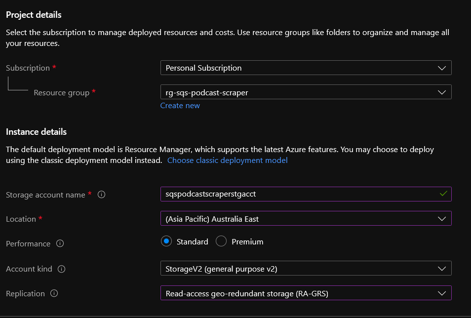
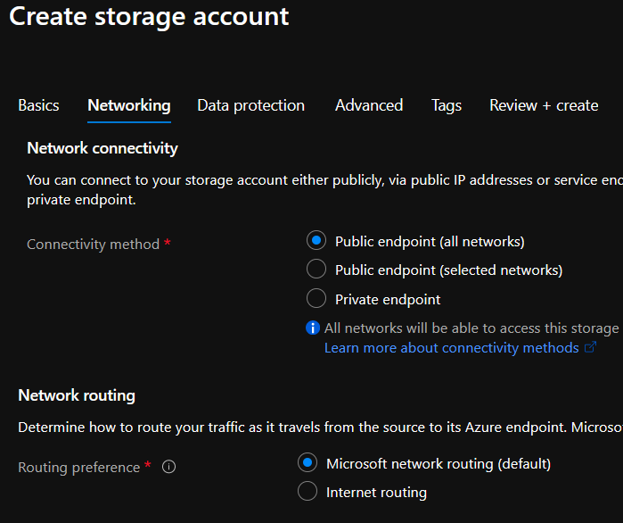
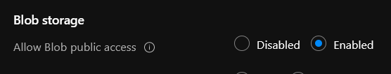
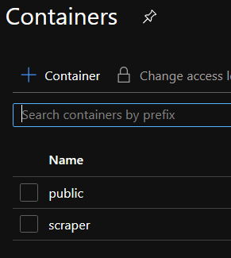
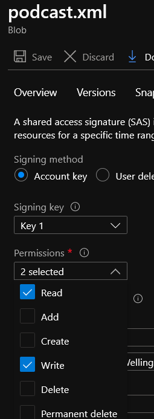
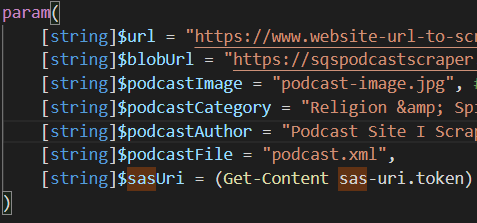

So, this project probably has a limited audience. Like, who wants to scrape episodes off a Squarespace hosted website, and convert them into a podcast-compatible XML feed for importing into a podcast app of their choice?

Well - me, for one! Probably the _only_ one.

This perhaps goes without saying, but Squarespace has a [built-in podcast feed feature](https://support.squarespace.com/hc/en-us/articles/205814338-Podcasting-with-Squarespace-overview) that makes it easy to add new podcast episodes etc.

My local church had recently visited the 21st Century and started posting messages online, which was great, but I wanted to get them in my podcast app as well!

Sure, I could have asked someone to learn to use the Squarespace podcasting feature, or even volunteered to do it myself, but it was ~~easier~~ ~~more fulfilling~~ ~~cheaper~~ more entertaining? to try script creating a podcast feed myself.

The idea of the script here is that it 

- scrapes the webpage for new audio block posts
- creates a new version of the podcast XML feed
- uploads it to Azure

We can then add the URL of the podcast XML feed to our podcast app, and it'll show those episodes in our podcast feed!

(I opted here to keep the podcast feed private, i.e. not submit it to Apple Podcasts etc. where everyone could see it, in case anyone was uncool with me making a publicly available resource _more_ publicly available.)


## Steps
Pretty easy!
- Create Azure Storage account and get access token
- Upload our PowerShell script etc. to Azure Storage
- Create an Azure Function to run our script daily

### Set up Azure Storage
OK, we're assuming a basic level of Azure-understanding here, like setting up a subscription, resource group, etc.!

Find Azure Storage and create a new storage account, pick a unique storage account name.

**Note**: This will be part of your podcast feed URL so try make it easy for yourself!
The other options won't matter much unless you expect high traffic volumes!



Next, networking tab, keep these all default



Same with Data protection tab, i.e. nothing enabled, and under Advanced I left everything default as well - just make sure public access to blobs is enabled.



Once you've created your storage account, create two new containers: 'public' (where your podcast feed will go), and 'scraper' (where your script & assets will go for the Azure Function)



## Azure Storage Permissions

Now, we need to create a shared access signature so that your script is able to modify the contents of this container.
There's a few ways you can do this
 - access key for the storage account
 - SAS token & URL to the container
 - SAS token & URLto a specific file
 - or a service principal. 
 
 This isn't a full discussion of the pros, cons and how-to's of permission models on Azure, but a 2 second explanation is "these are listed in _descending_ order of ease of setting up, and _ascending_ order of security/best practice".

 Because this isn't a production app for one of my Fortune-50 clients (haha, I jest), we can just do a SAS token & URL to the specific file (podcast.xml). I'll upload podcast-example.xml and podcast.xml from this repo, and then generate the SAS token & URL for podcast.xml, with read/write permissions.

 

Now, I copied the SAS URI and put it in a file sas-uri.token. I've ensured that *.token is in my .gitignore so I don't inadvertently push this to my public repo too!

We're just doing this for testing at the moment as we'll move the token to Azure Key Vault - one of the advantages of using Azure Functions!

## Test!!

Update the parameters of the Get-Podcast script to include your Azure Storage URL and SAS URI



Run the script in a local PowerShell window, and (if you've done everything right), your podcast.xml in Azure should now be updated with a properly formatted podcast RSS feed.

```powershell
.\Get-Podcasts.ps1
Retrieving podcasts from 'https://www.website-url-to-scrape.com/podcasts'
Parsed 23 episodes.
Building podcast feed XML
Done exporting podcast feed XML
Pushing podcast feed XML to blob storage

```

Test your podcast XML on a site like [CastFeed Validator](https://castfeedvalidator.com) and make sure its validating OK before moving onto the next step.

## Azure Function


